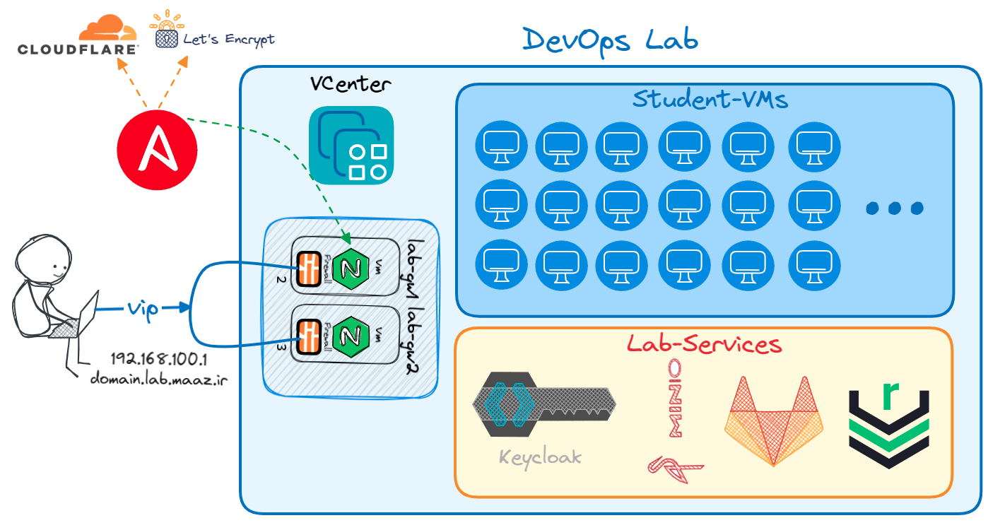

# DevOps Practice Lab with Ansible


This repository contains Ansible playbooks and roles to provision and manage a DevOps practice environment. The main goals are:

**Provisioning:** Create and delete virtual machines (VMs) for each student using a VMware (VCenter & ESXi) backend.

**DNS Management:** Automatically manage DNS records for each student domain.

**SSL Certificates:** Obtain SSL certificates for the environment domains.

**Nginx Configuration:** Configure Nginx on an "edge" or main machine to act as a reverse proxy and gateway for students.

**User Management:** Onboard and offboard students to/from the environment, including user accounts, Keycloak integration, and more.

---

## Table of Contents
1. [Overview](#overview)
2. [Prerequisites](#prerequisites)
3. [Repository Structure](#repository-structure)
4. [Inventory Example](#inventory-example)
5. [Playbooks](#playbooks)
   - [Create VMs](#create-vmsyml)
   - [Delete VMs](#delete-vmsyml)
   - [Setup Lab](#setup_labyml)
   - [On-Boarding](#on-boardingyml)
   - [Off-Boarding](#off-boardingyml)
6. [Usage Examples](#usage-examples)
7. [License](#license)
8. [Maintainer](#maintainer)

---

## Overview

This project provides a straightforward way to stand up a DevOps practice environment for multiple students. You can:

- **Create/Delete VMs**: Spin up or remove VMs automatically.  
- **DNS Setup**: Register DNS records for each student.  
- **SSL Certificates**: Obtain SSL certs (e.g., via Let’s Encrypt/ACME) for lab services.  
- **Nginx Edge Configuration**: Configure Nginx to handle routing and SSL termination.  
- **Onboard/Offboard Students**: Easily add or remove student environments, accounts, and more.

---

## Prerequisites

1. **Ansible 2.16.3+** (or later).  
2. Access or credentials to a hypervisor (VMware/ESXi) or cloud service if required.  
3. Domain or DNS server to manage subdomains (for student VMs).  
4. (Optional) [ACME](https://docs.ansible.com/ansible/latest/collections/community/crypto/acme_certificate_module.html)  modules for automated SSL.  

---

## Repository Structure

```yaml
.
├── inventory/
│   └── hosts.yml         # Main inventory example
├── roles/
│   ├── create_vms/
│   ├── delete_vms/
│   ├── setup_lab/
│   └── keycloak/
├── create-vms.yml            # Playbook to create VMs
├── delete-vms.yml            # Playbook to delete VMs
├── setup_lab.yml             # Playbook to configure the entire lab
├── on-boarding.yml           # Playbook to add a new student
├── off-boarding.yml          # Playbook to remove a student
└── README.md                 # This README
```

## Inventory Example
Below is a sample inventory.yml file:

```yaml
all:
  vars:
    ansible_user: root
    ansible_port: 8090
    VM_CPU: 4
    VM_MEMORY: 8192
    VM_STORAGE: 50
    VM_Folder: students
    ProxyJumpTarget: ssh -W %h:%p -q labe-lab
  children:
    Labb-Students:
      vars:
        VM_Folder: students
      hosts:
        student0:
          VM_Public_IP: 192.168.100.100
          DataStore_NAME: "SSD-SAMSUNG-4T-{{ 1 if (Client_Id % 2) != 0 else 2 }}"
          Client_Id: 0
          Client_State: present

        student1:
          VM_Public_IP: 192.168.100.101
          DataStore_NAME: "SSD-SAMSUNG-4T-{{ 1 if (Client_Id % 2) != 0 else 2 }}"
          Client_Id: 1
          Client_State: present

        # ...
        student4:
          VM_Public_IP: 192.168.100.104
          DataStore_NAME: "SSD-SAMSUNG-4T-{{ 1 if (Client_Id % 2) != 0 else 2 }}"
          Client_Id: 4
          Client_State: present
```

## Key fields:

**VM_*:** Define default VM configurations.

**Client_Id / Client_State:** Identify VM and define whether it should be created (present) or deleted (absent).

**ProxyJumpTarget:** Use a jump or bastion host if applicable.

# Playbooks


### create-vms.yml
```yaml
---
- hosts: all
  name: create vms
  become: true
  gather_facts: false
  roles:
    - { role: create_vms, become: True, tags: create-vms }
```
**Purpose:** Creates VMs for all or specific hosts in the inventory.


### delete-vms.yml
```yaml
---
- hosts: all
  name: delete vms
  become: true
  gather_facts: false
  roles:
    - { role: delete_vms, become: True, tags: delete-vms }
```
**Purpose:** Removes VMs for all or specific hosts in the inventory.


### setup_lab.yml
```yaml
---
- hosts: all
  name: setup-lab
  roles:
    - { role: setup_lab, become: True, tags: setup-lab }
```
**Purpose:** Configures DNS, obtains SSL certificates, sets up Nginx, etc.


### on-boarding.yml
```yaml
---
- hosts: student94
  name: create vms
  become: true
  gather_facts: false
  vars:
    VM_CPU: 2
    VM_MEMORY: 4096
    VM_STORAGE: 50
    VM_Folder: students
  roles:
    - { role: create_vms, become: True, tags: create-vms }

- hosts: labe-lab
  name: setup lab
  become: true
  gather_facts: false
  vars:
    loop_list:
      - State: present
        Type: student
        StudentID: 94
        Target_IP: 192.168.100.194
        Firewall_SSHPort: 7194
        Dns_Subdomain: st94
        StudentUserName: st94
        StudentPass: "{{ student_pass_94 }}"
        StudentName: STUDENT FIRST NAME
        StudentLastName: STUDENT LAST NAME
        StudentEmail: STUDENT EMAIL
        Nginx_Conf_File: student_94
        MinioBucket: bucket-term2 # bucket-term1 or bucket-term2 or bucket-term12 (1, 2)
  roles:
    - { role: setup_lab, become: True, tags: setup-lab }
    - { role: keycloak, become: True, tags: keycloak }
Purpose: Adds a new student by creating their VM and configuring all related services.
```

### off-boarding.yml
```yaml
---
- hosts: student77
  name: delete vms
  become: true
  gather_facts: false
  roles:
    - { role: delete_vms, become: True, tags: delete-vms }

- hosts: labe-lab
  name: setup lab
  become: true
  gather_facts: false
  vars:
    loop_list:
      - State: absent
        Type: student
        StudentID: 77
        Target_IP: 192.168.100.177
        Firewall_SSHPort: 7177
        Dns_Subdomain: st77
        StudentUserName: st77
        StudentPass: "{{ student_pass_77 }}"
        StudentName: STUDENT FIRST NAME
        StudentLastName: STUDENT LAST NAME
        StudentEmail: STUDENT EMAIL
        Nginx_Conf_File: student_77
        MinioBucket: bucket-term1
  roles:
    - { role: setup_lab, become: True, tags: setup-lab }
    - { role: keycloak, become: True, tags: keycloak }
```

**Purpose:** Removes a student by deleting their VM and cleaning up DNS, Keycloak, etc.

# Usage Examples
Below are some sample commands for this repository:

### Create a VM for student70

```bash
ansible-playbook ./create-vms.yml --limit=student70
```

### Delete all VMs for the group Lab-Students

```bash
ansible-playbook ./delete-vms.yml --limit=Lab-Students
```

### Run setup_lab.yml to only obtain SSL certificates on the labe-lab host

```bash
ansible-playbook ./setup_lab.yml --limit="labe-lab" --tags=acme
```

### On-board a new student (e.g., student83)

```bash
ansible-playbook ./on-boarding.yml --limit=student83
```

### Off-board a student

```bash
ansible-playbook ./off-boarding.yml
```

# License
This project is licensed under the MIT License. Please see the LICENSE file for details.

# Maintainer
**MaaZ** (m.ahmadizarei@gmail.com)

# `Happy automating!`


